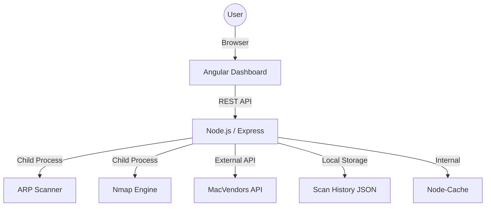

# 📡 NetWatch AI: Advanced Network Intelligence & Monitoring

NetWatch AI is a professional-grade, full-stack network monitoring and security analysis platform. It combines real-time device discovery with the power of **Nmap** to provide deep insights into network topography, service exposure, and security vulnerabilities.

---

## 📑 Table of Contents
- [Project Overview](#-project-overview)
- [System Architecture](#-system-architecture)
- [How It Works](#-how-it-works)
- [Key Features](#-key-features)
- [Detailed Scan Profiles](#-detailed-scan-profiles)
- [Tech Stack](#-tech-stack)
- [Installation Guide](#-installation-guide)
- [Security & Safety](#-security--safety)

---

## 🎯 Project Overview
The primary goal of NetWatch AI is to provide network administrators and security researchers with a centralized, visual dashboard to monitor local network health. Built on top of the industry-standard **Nmap** engine, it moves beyond simple "up/down" monitoring to provide deep packet-level intelligence.

## 🏗 System Architecture



## ⚙️ How It Works

### 1. Network Discovery (The Pulse)
The backend periodically triggers an `arp -a` command. This native utility maps IP addresses to Physical (MAC) addresses currently active in the ARP table.
*   **Enrichment**: Each discovered MAC address is sent to a vendor lookup service to determine the manufacturer (e.g., Apple, Cisco, Sony).
*   **Heuristics**: Based on vendor strings and hostnames, the system intelligently categorizes devices (e.g., "TP-Link" -> "Router").

### 2. Advanced Scanning (The Deep Dive)
When a user selects **Advanced Scan**, the `NmapManager` module takes over:
*   **Scan Queuing**: To prevent system saturation and high CPU usage, all Nmap scans are queued and executed sequentially.
*   **XML Orchestration**: Nmap is executed with the `-oX -` flag. This directs the engine to output results in XML format, which the backend then parses using `xml2js` to extract granular data about ports, service versions, and OS fingerprints.
*   **Temporal Logging**: Every scan is timestamped and saved. This allows the frontend to show changes in a device's security posture over time.

## ✨ Key Features

### 🖥 Premium Dashboard
*   **Dynamic Analytics**: Real-time charts showing device distribution and top vendors.
*   **Live Status Monitoring**: Instant feedback on device online/offline states.
*   **Global Search**: Filter through hundreds of devices by IP, MAC, or Vendor instantly.

### 🛡 Scan Center (Nmap Integrated)
*   **Service Versioning**: Identifies exactly what software is running (e.g., `Apache 2.4.41` on port 80).
*   **Vulnerability Detection**: Leverages Nmap Scripting Engine (NSE) to find common security holes.
*   **OS Fingerprinting**: High-accuracy guesses of the device's operating system based on TCP/IP stack behavior.
*   **Path Mapping**: Standalone **Traceroute** to visualize internal routing hops.

## 🔍 Detailed Scan Profiles

| Profile | Command | Use Case |
| :--- | :--- | :--- |
| **Quick** | `-F` | 100 most common ports. Fast and stealthy. |
| **Standard** | `-sV` | Port scan + Service/Version detection. |
| **Full** | `-p-` | Scans all 65,535 ports. Finds hidden services. |
| **OS Detection**| `-O` | Identifies OS (requires root/admin). |
| **Vuln** | `--script vuln` | Checks for known CVEs and misconfigurations. |
| **Aggressive** | `-A` | OS detection, Versioning, Script scanning, and Traceroute. |

## 💻 Tech Stack

### Frontend
- **Framework**: Angular 21 (Standalone Components)
- **Styling**: Tailwind CSS (Premium Dark Theme)
- **Icons**: Lucide-Angular
- **Charts**: Chart.js

### Backend
- **Environment**: Node.js / Express
- **Networking**: `child_process` execution of system binaries.
- **Parsing**: `xml2js` for Nmap XML output.
- **Caching**: `node-cache` (Memory-based).

---

## 🚀 Installation Guide

### Prerequisites
1.  **Node.js** (LTS version)
2.  **Nmap**: [Download Here](https://nmap.org/download.html). Ensure `nmap` is added to your environment variables (System PATH).

### 1. Clone & Install Dependencies
```bash
git clone https://github.com/YOUR_USER/wifi-tracker.git
cd wifi-tracker
```

### 2. Backend Configuration
Navigate to the `backend` folder and create a `.env` file:
```env
PORT=3000
NETWORK_RANGE=192.168.1.0/24  # Change to your subnet
CACHE_DURATION=30             # Cache scans for 30s
```
Install and run:
```bash
cd backend
npm install
node index.js
```

### 3. Frontend Configuration
Navigate to the `frontend` folder:
```bash
cd frontend
npm install
ng serve
```

## 🔒 Security & Safety
NetWatch AI is built for **Ethical Network Analysis**.
*   **Private Range Lock**: The backend validates all targets. If a target is outside the private IP range (RFC 1918), the scan is blocked to prevent external scanning.
*   **No Root Required (Mostly)**: Standard scans work without elevated privileges. Advanced features like OS Detection may require running the backend terminal as **Administrator**.
*   **Rate Limiting**: Integrated delays between vendor lookups to avoid API blacklisting.

---

## ⚖️ License
This project is licensed under the ISC License.

---
*Developed for advanced network transparency.*
